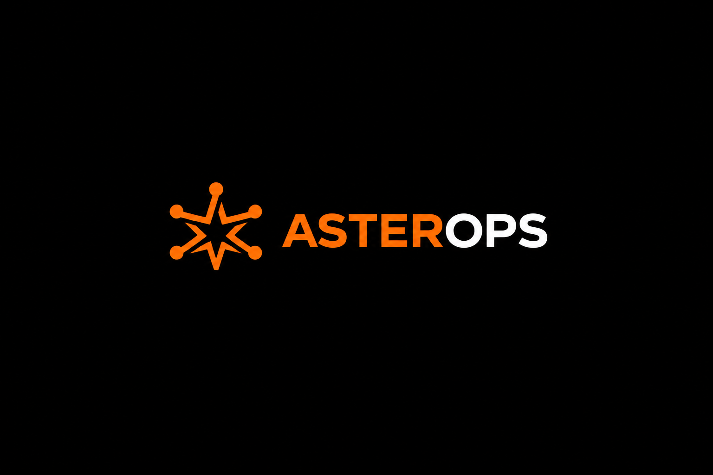

**An open-source platform for centralized VoIP infrastructure management, automated security hardening, and compliance auditing.**

 

---

## Dashboard Preview

> **A single control plane for provisioning, securing, monitoring, and auditing your VoIP infrastructure.**

---

## Why AsterOps?

Managing Asterisk infrastructure at scale is often repetitive, error-prone, and difficult to standardize. Security hardening is frequently performed manually, configurations drift over time, and operational visibility is fragmented across multiple tools.

**AsterOps** solves this by providing a centralized platform that automates provisioning, security hardening, compliance auditing, and Multiple server management for VoIP infrastructure.

Whether you're operating a single PBX or managing hundreds of deployments across multiple servers, AsterOps helps you build secure, consistent, and manageable VoIP environments.

It started as a university project on automated VoIP security hardening and it continues as an open-source platform because secure communications infrastructure deserves modern engineering practices.

---

## Core Features

- Automated VoIP Provisioning
- Security Hardening Engine
- TLS & SRTP Enforcement
- Centralized Management Dashboard
- Configuration as Code
- Compliance Reporting
- Audit Logging
- Multi-Server Management

---
