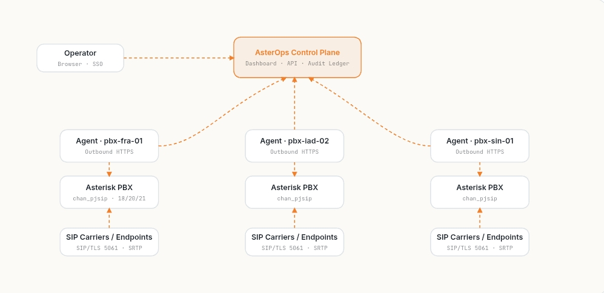

<div align="center">


**An open-source platform for centralized VoIP infrastructure management, automated security hardening, and compliance auditing.**

<br>

[](LICENSE)
[](https://www.python.org)
[](https://react.dev)
[](https://www.asterisk.org)
[](#roadmap)
[](#contributing)

</div>

---

## Table of Contents

- [Dashboard Preview](#dashboard-preview)
- [Why AsterOps?](#why-asterops)
- [Core Features](#core-features)
- [Highlights](#highlights)
- [Architecture](#architecture)
- [Getting Started](#getting-started)
- [Roadmap](#roadmap)
- [Contributing](#contributing)
- [License](#license)

## Dashboard Preview

> **A single control plane for provisioning, securing, monitoring, and auditing your VoIP infrastructure.**

<p align="center">



</p>

---

## Why AsterOps?

Managing VoIP infrastructure at scale is often repetitive, error-prone, and difficult to standardize. Security hardening is frequently performed manually, configurations drift over time, and operational visibility is fragmented across multiple tools.

**AsterOps** solves this by providing a centralized platform that automates provisioning, security hardening, compliance auditing, and Multiple server management for VoIP infrastructure.

Whether you're operating a single PBX or managing hundreds of deployments across multiple servers, AsterOps helps you build secure, consistent, and manageable VoIP environments.

It started as a university project on automated VoIP security hardening and it continues as an open-source platform because secure communications infrastructure deserves modern engineering practices.

---

## Core Features

``` text
- Automated VoIP Provisioning
- Security Hardening Engine
- TLS & SRTP Enforcement
- Centralized Management Dashboard
- Configuration as Code
- Compliance Reporting
- Audit Logging
- Multi-Server Management
```

---

## Highlights

### Security Hardening Engine

Automatically applies opinionated security baselines to Asterisk deployments, helping reduce attack surface while maintaining repeatable and auditable configurations.

**Includes:**

``` text
- TLS 1.2+ configuration
- SRTP enforcement
- Fail2Ban integration
- iptables / nftables configuration
- AMI hardening
- SSH hardening
- File permission enforcement
- Firewall configuration 
- Automatic configuration backups
- Dry-run support before applying changes
```

---

### Automated Configuration

Define your infrastructure once using simple YAML files and let AsterOps generate deterministic manageable Asterisk configuration files.

Supported configuration generation includes:

- `pjsip.conf`
- `extensions.conf`
- `rtp.conf`

The same input always produces the same output, reducing configuration drift and minimizing human error.

---

### Security Posture & Compliance Reporting

Continuously assess the security posture of every managed server.

Generate:

- `JSON reports`
- `Standalone HTML reports`
- `PDF exports`

Each report includes:

- `Security score (0–100)`
- `Individual security checks`
- `QoS results`
- `Recommended remediation steps`

Reports can be uploaded automatically to the centralized dashboard for fleet-wide visibility.

---

### 🖥️ Centralized Server Management

Manage multiple Asterisk servers from a single dashboard.

Capabilities include:

``` text
- Server overview
- Security posture monitoring
- Provisioning workspace
- Audit logs
- Call records
- Alert management
```

Designed for organizations managing multiple PBX deployments.

---

### Extensible Platform Architecture

AsterOps is designed around a modular platform abstraction.

While Asterisk is currently the primary supported platform, the architecture allows additional VoIP platforms to be integrated through a lightweight `VoipPlatform` interface.

Future platform support includes:

- **`FreeSWITCH`**
- **`Kamailio`**
- **`OpenSIPS`**

---

### Built for Reliability

Quality is built into the development workflow.

Current testing includes:

``` text
- Golden-file renderer tests
- Profile loader validation
- Security scoring tests
- Configuration generation verification
```

The goal is predictable, repeatable infrastructure automation that engineers can trust.

---

## Architecture

AsterOps follows a lightweight agent-based architecture designed for secure, scalable, and centralized VoIP infrastructure management.

Each managed server runs a local **AsterOps Agent**, responsible for provisioning, security hardening, verification, and reporting. The agent communicates securely with the centralized control plane, allowing administrators to manage multiple deployments without exposing SSH access or directly modifying remote systems.

<p align="center">

<!-- Replace with architecture diagram -->


</p>


---

# Getting Started

Get AsterOps running in minutes.

## Prerequisites

Before installing AsterOps, ensure your environment meets the following requirements.

```text
Operating System

✓ Linux
✓ Ubuntu 22.04+ (Recommended)
✓ Debian 12+

Python

✓ Python 3.10+

Supported PBX

✓ Asterisk 18
✓ Asterisk 20
✓ Asterisk 22+
```

---

## Installation

Install the AsterOps Agent on your PBX.

```bash
pip install asterops-agent
```

Verify the installation.

```bash
asterops --version
```

View the available security profiles.

```bash
sudo asterops profiles
```

---

## Security Hardening

Preview all planned changes without modifying your server.

```bash
sudo asterops run --profile baseline --dry-run
```

Apply the selected security profile.

```bash
sudo asterops run --profile baseline
```

---

## Provision Your PBX

Create an inventory file.

```yaml
server_name: hq-pbx-01

tls_only: true

rtp_start: 10000

rtp_end: 20000

endpoints:

  - extension: "1001"

    display_name: "Reception"

    codecs:

      - opus
      - ulaw
      - alaw

    tls_required: true

    srtp_required: true

trunks:

  - name: telnyx-primary

    host: sip.telnyx.com

    port: 5061

    username: my-trunk-user

    transport: transport-tls

    srtp_required: true
```

Generate and apply the configuration.

```bash
sudo asterops provision inventory.yaml --dry-run

sudo asterops provision inventory.yaml

sudo asterisk -rx "pjsip reload"
```

---

## Upload Security Reports

Configure the agent.

```bash
export ASTEROPS_URL=https://your-control-plane/functions/v1

export ASTEROPS_AGENT_TOKEN=YOUR_TOKEN
```

Generate and upload a report.

```bash
asterops report --profile baseline
```

---

## Roadmap

AsterOps is under active development. The roadmap below outlines the planned evolution of the platform.

### Phase 1 — Foundation

- Automated Security Hardening
- Configuration as Code
- Security Profiles
- Compliance Reporting
- Centralized Dashboard
- Agent-based Architecture

---

### Phase 2 — Platform Expansion

- FreeSWITCH Support
- Kamailio Support
- OpenSIPS Support
- Enhanced Audit Logging
- Kubernetes Deployment

---


## Contributing

Contributions of all sizes are welcome.

Whether you're fixing a typo, improving documentation, reporting bugs, or implementing new features, every contribution helps make AsterOps better.


Please ensure:

- New functionality includes appropriate tests.
- Existing tests continue to pass.
- Documentation is updated where necessary.
- Pull requests remain focused on a single feature or fix.

---

## Reporting Issues

Found a bug?

Have a feature request?

Please open an issue describing:

- Expected behavior
- Actual behavior
- Steps to reproduce
- Environment details
- Relevant logs (if available)

Clear and reproducible reports help us resolve issues faster.

---


